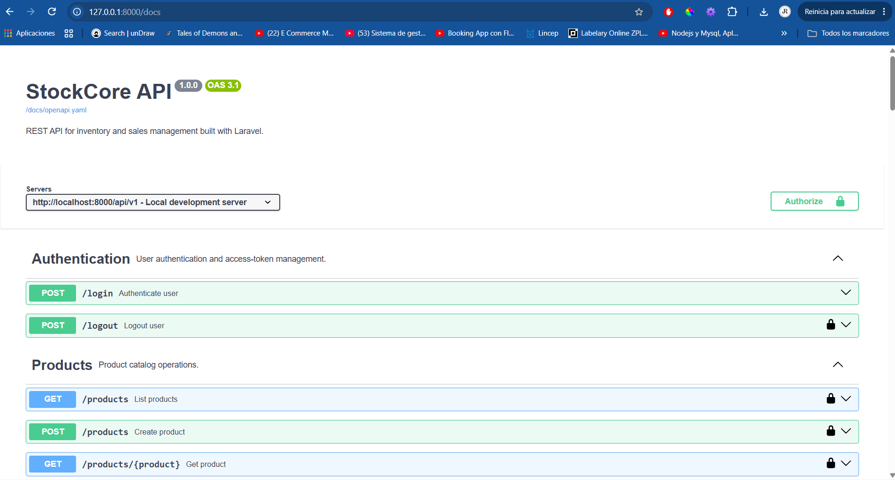

# StockCore


**API REST para la gestión de inventario y operaciones comerciales desarrollada con Laravel 13 y PostgreSQL.**

StockCore es un sistema backend diseñado para gestionar productos, categorías, proveedores, clientes, inventario, movimientos de stock y órdenes de venta mediante una API REST versionada.

El proyecto está enfocado en aplicar conceptos de backend utilizados en aplicaciones reales, incluyendo autenticación, autorización basada en roles y permisos, operaciones transaccionales, control de concurrencia sobre inventario, integridad de datos y pruebas automatizadas.

> Proyecto de portafolio enfocado en desarrollo backend profesional con Laravel.

---

## Contenido

- [Sobre el proyecto](#sobre-el-proyecto)
- [Capturas de pantalla](#capturas-de-pantalla)
- [Funcionalidades](#funcionalidades)
- [Stack tecnológico](#stack-tecnológico)
- [Arquitectura](#arquitectura)
- [Decisiones técnicas](#decisiones-técnicas)
- [Roles y permisos](#roles-y-permisos)
- [Modelo de datos](#modelo-de-datos)
- [Reglas de negocio](#reglas-de-negocio)
- [Documentación de la API](#documentación-de-la-api)
- [Testing y calidad](#testing-y-calidad)
- [Instalación](#instalación)
- [Cómo probar StockCore](#cómo-probar-stockcore)
- [Autor](#autor)

---

## Sobre el proyecto

StockCore modela las operaciones principales de un sistema de gestión de inventario y ventas:

- Permite gestionar productos y categorías.
- Permite registrar y administrar proveedores.
- Permite asociar productos con categorías y proveedores.
- Mantiene un inventario individual para cada producto.
- Permite configurar niveles mínimos y máximos de stock.
- Registra entradas, salidas y ajustes de inventario.
- Mantiene un historial de movimientos con el stock anterior y resultante.
- Registra el usuario responsable de cada movimiento de inventario.
- Permite consultar y filtrar el historial de movimientos.
- Permite registrar y administrar clientes.
- Permite crear órdenes de venta con múltiples productos.
- Conserva el precio del producto al momento de realizar la venta.
- Calcula los subtotales y el total de cada orden desde el backend.
- Descuenta automáticamente las existencias al registrar una venta.
- Genera automáticamente los movimientos de salida asociados a una orden.
- Valida las reglas de negocio antes de modificar las existencias.
- Protege las operaciones de inventario mediante transacciones y control de concurrencia.
- Protege la API mediante autenticación con tokens.
- Controla el acceso a las operaciones mediante roles y permisos.

La creación de una orden integra clientes, productos, usuarios, inventario y movimientos de stock dentro de una única operación transaccional,
manteniendo la consistencia de los datos incluso cuando una operación no puede completarse.

El objetivo del proyecto es demostrar el desarrollo de una **API REST profesional con Laravel**, aplicando diseño de APIs, relaciones con Eloquent, validación, autenticación y autorización, reglas de negocio, consistencia transaccional, control de concurrencia, integridad de datos con PostgreSQL y pruebas automatizadas.

---

## Capturas de pantalla

### Documentación interactiva de la API
StockCore cuenta con documentación interactiva basada en **OpenAPI 3.1 y Swagger UI**, que permite explorar los endpoints disponibles, consultar sus esquemas y probar las operaciones de la API directamente desde el navegador.

<p align="center">
  
</p>

---

## Funcionalidades

StockCore organiza sus funcionalidades en diferentes áreas del dominio:

### Catálogo

Gestión del catálogo de productos y de la información necesaria para su comercialización:

- Productos con SKU, precio y estado.
- Clasificación mediante múltiples categorías.
- Registro de proveedores.
- Asociación de múltiples proveedores a un producto.
- SKU y costo específicos por proveedor.

### Inventario

Control de las existencias y trazabilidad de los cambios realizados sobre ellas:

- Inventario individual asociado a cada producto.
- Configuración de niveles mínimos y máximos de stock.
- Movimientos de entrada, salida y ajuste.
- Registro del stock anterior y resultante de cada movimiento.
- Historial de movimientos por producto.
- Registro del usuario responsable de cada operación.

### Clientes y ventas

Gestión de clientes y registro de operaciones de venta:

- Registro y actualización de clientes.
- Órdenes con múltiples productos.
- Asociación opcional de un cliente a la orden.
- Registro del usuario que realiza la venta.
- Conservación del precio histórico de cada producto vendido.
- Cálculo de subtotales y total de la orden desde el servidor.
- Actualización automática del inventario al completar una venta.
- Generación automática de movimientos de salida.

### Seguridad y acceso

Protección de los recursos y operaciones disponibles en la API:

- Autenticación mediante tokens.
- Roles `admin`, `seller` y `warehouse`.
- Permisos específicos según la operación.
- Autorización aplicada antes de ejecutar operaciones protegidas.

---

## Stack tecnológico

| Área                    | Tecnología                          |
| ----------------------- | ----------------------------------- |
| Backend                 | PHP 8.3+ · Laravel 13               |
| Base de datos           | PostgreSQL                          |
| Autenticación           | Laravel Sanctum                     |
| Roles y permisos        | Spatie Laravel Permission           |
| Testing                 | PHPUnit                             |
| Calidad de código       | Laravel Pint                        |
| Documentación API       | OpenAPI 3.1 · Swagger UI · Postman  |
| Gestión de dependencias | Composer                            |
| Control de versiones    | Git · GitHub                        |

---

## Arquitectura

StockCore sigue una arquitectura basada en Laravel MVC, separando la validación, autorización, lógica de negocio y representación de las respuestas de la API.

Las operaciones de negocio principales siguen un flujo similar a:

```text
Request
   ↓
Form Request
   ↓
Controller
   ↓
Action
   ↓
Models / Database
   ↓
API Resource
   ↓
JSON Response
```

### Responsabilidades

| Componente        | Responsabilidad                                                                        |
| ----------------- | -------------------------------------------------------------------------------------- |
| **Routes**        | Definen los endpoints, versionado y middleware de la API.                              |
| **Form Requests** | Validan los datos de entrada y autorizan operaciones cuando corresponde.               |
| **Controllers**   | Reciben las solicitudes y coordinan el flujo HTTP.                                     |
| **Actions**       | Encapsulan operaciones de negocio que requieren múltiples pasos o modelos.             |
| **Models**        | Representan las entidades, relaciones y comportamiento mediante Eloquent.              |
| **API Resources** | Transforman los modelos en respuestas JSON consistentes.                               |
| **Database**      | Refuerza la integridad de los datos mediante claves foráneas, índices y restricciones. |

---

## Decisiones técnicas

StockCore incorpora varias decisiones orientadas a mantener la consistencia de los datos, separar responsabilidades y representar escenarios reales de una API de inventario y ventas.

### Operaciones transaccionales

Las operaciones que modifican múltiples recursos se ejecutan dentro de transacciones de base de datos.

La creación de una orden, por ejemplo, registra la venta, crea sus detalles, actualiza el inventario y genera los movimientos de stock correspondientes como una única operación. Si alguno de estos pasos falla, los cambios realizados se revierten.

### Control de concurrencia

Las modificaciones de inventario utilizan bloqueo pesimista mediante `lockForUpdate()` para evitar que operaciones concurrentes modifiquen simultáneamente las mismas existencias.

Esto permite validar y actualizar el stock sobre un estado consistente dentro de la transacción.

### Integridad desde la base de datos

Además de las validaciones realizadas por Laravel, PostgreSQL refuerza reglas importantes mediante claves foráneas, restricciones de unicidad y `CHECK constraints`.

Entre estas reglas se encuentran:

- El stock no puede ser negativo.
- La cantidad de un movimiento debe respetar las reglas definidas para su tipo.
- La cantidad de un detalle de pedido debe ser mayor que cero.
- Los valores monetarios almacenados no pueden ser negativos.
- Un producto mantiene un único registro de inventario.

### Precio histórico de venta

Cada detalle de una orden almacena el precio del producto en el momento de realizar la venta.

De esta forma, una modificación posterior del precio del producto no altera el valor histórico de las órdenes existentes.

### Lógica de negocio mediante Actions

Las operaciones que requieren coordinar varios modelos o realizar múltiples pasos se encapsulan en clases `Action`.

Esto permite mantener los controladores enfocados en el flujo HTTP y concentrar la lógica de operaciones como la creación de productos, movimientos de stock y órdenes.

### Autorización por operación

StockCore combina autenticación mediante Laravel Sanctum con roles y permisos administrados mediante Spatie Laravel Permission.

La autorización se aplica según el tipo de operación: los `Form Requests` autorizan solicitudes de escritura y Laravel Gate protege consultas cuando corresponde.

---

## Roles y permisos

StockCore implementa control de acceso basado en roles y permisos mediante **Spatie Laravel Permission**.

El sistema incluye tres roles principales:

| Rol           | Responsabilidad                                                                            |
| ------------- | ------------------------------------------------------------------------------------------ |
| **Admin**     | Administración completa del sistema, catálogo, proveedores, clientes, inventario y ventas. |
| **Seller**    | Gestión de clientes y ventas, con acceso de consulta al catálogo e inventario.             |
| **Warehouse** | Gestión operativa del inventario y sus movimientos.                                        |

### Acceso por módulo

| Módulo               |  Admin  |  Seller  | Warehouse |
| -------------------- | :-----: | :------: | :-------: |
| Productos            | Gestión | Consulta | Consulta  |
| Categorías           | Gestión | Consulta |     —     |
| Proveedores          | Gestión |    —     |     —     |
| Producto–Proveedor   | Gestión |    —     |     —     |
| Clientes             | Gestión | Gestión  |     —     |
| Inventario           | Gestión | Consulta |  Gestión  |
| Movimientos de stock | Gestión |    —     |  Gestión  |
| Pedidos              | Gestión | Gestión  |     —     |

> Los permisos se aplican por operación, por lo que el acceso a un módulo no implica necesariamente permisos de creación o modificación sobre todos sus recursos.
>
> **Nota:** las existencias no se modifican directamente desde el inventario. Las entradas, salidas y ajustes se realizan mediante movimientos de stock para conservar la trazabilidad de cada cambio.

---

## Modelo de datos

StockCore utiliza un modelo relacional en PostgreSQL para representar el catálogo, inventario, proveedores, clientes y operaciones de venta.

### Entidades principales

- **User:** usuario autenticado que realiza operaciones dentro del sistema.
- **Product:** producto disponible en el catálogo.
- **Category:** clasificación asociada a uno o varios productos.
- **Supplier:** proveedor de productos.
- **Inventory:** existencias y niveles de stock asociados a un producto.
- **StockMovement:** registro de una entrada, salida o ajuste de inventario.
- **Customer:** cliente que puede ser asociado a una orden.
- **Order:** operación de venta registrada en el sistema.
- **OrderItem:** producto, cantidad y precio histórico dentro de una orden.

### Relaciones principales

```text
Product ─────── 1:1 ─────── Inventory
   │
   ├────────── N:M ───────── Category
   │
   └────────── N:M ───────── Supplier
                              │
                              └── supplier_sku
                                  cost

Inventory ───── 1:N ─────── StockMovement
                              │
User ─────────────────────────┘


Customer ────── 1:N ─────── Order
                              │
User ────────── 1:N ─────────┤
                              │
                              └──── 1:N ──── OrderItem
                                               │
Product ─────── 1:N ───────────────────────────┘
```

La relación **Product–Supplier** utiliza una tabla intermedia que almacena información propia de la relación, como el SKU utilizado por el proveedor y el costo del producto.

`OrderItem` conserva el precio unitario y subtotal de la venta, permitiendo mantener el historial de una orden independientemente de cambios posteriores en el precio actual del producto.

---

## Reglas de negocio

StockCore aplica reglas de negocio para proteger la consistencia del inventario y de las operaciones de venta.

### Productos e inventario

- Cada producto posee un único registro de inventario.
- Todo producto nuevo inicia con `0` unidades disponibles.
- Las existencias no pueden tener valores negativos.
- Las cantidades disponibles no se modifican directamente desde la configuración del inventario.
- Los cambios de existencias se realizan mediante movimientos de stock para mantener su trazabilidad.

### Movimientos de stock

StockCore maneja tres tipos de movimientos:

- **Entry:** incrementa las existencias.
- **Exit:** disminuye las existencias.
- **Adjustment:** establece una cantidad ajustada de inventario.

Cada movimiento conserva:

- Cantidad involucrada.
- Stock anterior.
- Stock resultante.
- Motivo de la operación.
- Usuario responsable.

Una salida no puede completarse cuando la cantidad solicitada supera las existencias disponibles.

### Pedidos y ventas

- Una orden debe contener al menos un producto.
- Un mismo producto no puede aparecer repetido dentro de la misma orden.
- La cantidad de cada producto debe ser mayor que `0`.
- El cliente es opcional.
- El usuario responsable se obtiene de la sesión autenticada.
- Los precios utilizados en la venta se obtienen desde el servidor y no desde la solicitud del cliente.
- Cada `OrderItem` conserva el precio unitario del producto en el momento de la venta.
- Los subtotales y el total de la orden son calculados por el backend.
- Registrar una venta genera automáticamente los movimientos de salida correspondientes.
- Si no existe stock suficiente para cualquiera de los productos, la operación no puede completarse.
- La creación de la orden y la actualización del inventario forman parte de una misma operación transaccional.

### Integridad de datos

La base de datos refuerza reglas críticas independientemente de las validaciones realizadas por la aplicación:

- El stock no puede ser negativo.
- Las cantidades de los detalles de una orden deben ser mayores que `0`.
- Los precios, subtotales y totales almacenados no pueden ser negativos.
- Un producto solo puede tener un registro de inventario.
- Un producto no puede repetirse dentro de una misma orden.

---

## Documentación de la API

StockCore cuenta con una especificación formal de la API basada en **OpenAPI 3.1**, disponible en:

```text
docs/openapi.yaml
```

La especificación documenta los endpoints disponibles, métodos HTTP, parámetros, cuerpos de las solicitudes, respuestas, esquemas de datos y autenticación.

El proyecto integra **Swagger UI** para explorar y probar la API de forma interactiva desde el navegador:

```text
http://127.0.0.1:8000/docs
```

Desde Swagger UI es posible iniciar sesión, utilizar el token generado por Laravel Sanctum mediante **Bearer Authentication** y ejecutar directamente los endpoints protegidos.

La API está versionada bajo el prefijo:

```text
/api/v1
```

También se incluye una colección de **Postman** preparada para importar y probar los endpoints de la API:

📦 [Descargar colección de Postman](docs/StockCoreAPI.postman_collection.json)

Los endpoints protegidos utilizan el siguiente esquema de autenticación:

```http
Authorization: Bearer <token>
Accept: application/json
```

También se encuentra disponible una versión publicada de la documentación:

📚 [Consultar documentación pública de StockCore](https://stockcore-api.docs.buildwithfern.com)

---

## Testing y calidad

StockCore cuenta con pruebas automatizadas para verificar el comportamiento de los principales módulos de la API, incluyendo autenticación, autorización, catálogo, inventario, movimientos de stock, clientes y órdenes.

La suite utiliza **PHPUnit** junto con las herramientas de testing de Laravel y actualmente cuenta con:

```text
57 tests
509 assertions
```
Las pruebas utilizan una base de datos `PostgreSQL` independiente (stockcore_testing) y `RefreshDatabase` para mantener un entorno aislado y reproducible durante cada ejecución.
El proyecto utiliza además Laravel Pint para mantener un estilo de código consistente

---

## Instalación

### Requisitos

- PHP 8.3+
- Composer
- PostgreSQL
- Git

### Configuración

Clona el repositorio e instala las dependencias:

```bash
git clone https://github.com/josecarlosonate/StockCore.git
cd StockCore
composer install
```

Crea el archivo de entorno y genera la clave de la aplicación:

```bash
cp .env.example .env
php artisan key:generate
```

Configura la conexión a PostgreSQL en `.env` y ejecuta las migraciones junto con los datos iniciales:

```bash
php artisan migrate --seed
```

Inicia el servidor de desarrollo:

```bash
php artisan serve
```

La API estará disponible bajo:

```text
http://127.0.0.1:8000/api/v1
```

La documentación interactiva con Swagger UI está disponible en:

```text
http://127.0.0.1:8000/docs
```

---

## Cómo probar StockCore

Después de ejecutar las migraciones y seeders, StockCore incluye tres usuarios de prueba con diferentes niveles de acceso:

| Rol           | Email                      | Contraseña    |
| ------------- | -------------------------- | ------------- |
| Admin         | admin@stockcore.test       | password123   |
| Seller        | seller@stockcore.test      | password123   |
| Warehouse     | warehouse@stockcore.test   | password123   |

La API puede probarse desde **Swagger UI** accediendo a:

```text
http://127.0.0.1:8000/docs
```

Un flujo recomendado para comprobar las principales reglas de negocio es:

1. Iniciar sesión como `warehouse@stockcore.test`.
2. Registrar una entrada de stock para uno de los productos.
3. Verificar que el inventario refleje las nuevas existencias.
4. Iniciar sesión como `seller@stockcore.test`.
5. Crear una orden utilizando un producto con stock disponible.
6. Consultar la orden creada.
7. Verificar que el inventario haya disminuido.
8. Consultar los movimientos de stock y comprobar la salida generada por la venta.

Este flujo permite comprobar la autenticación, autorización por roles, movimientos de inventario, creación de órdenes y actualización transaccional del stock.

---

## Autor

**Jose Carlos Oñate Rodríguez**

Proyecto de portafolio --- Laravel 13 / PostgreSQL / REST API
